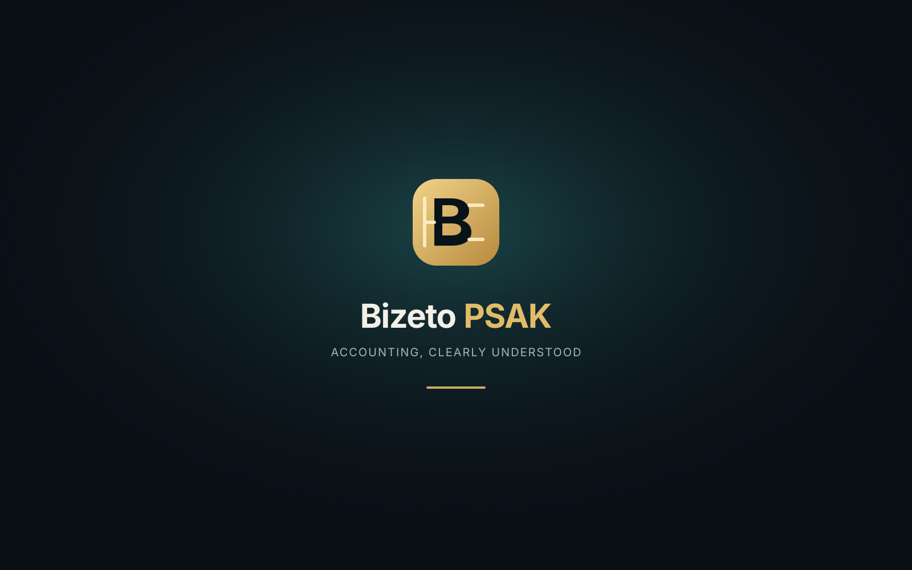
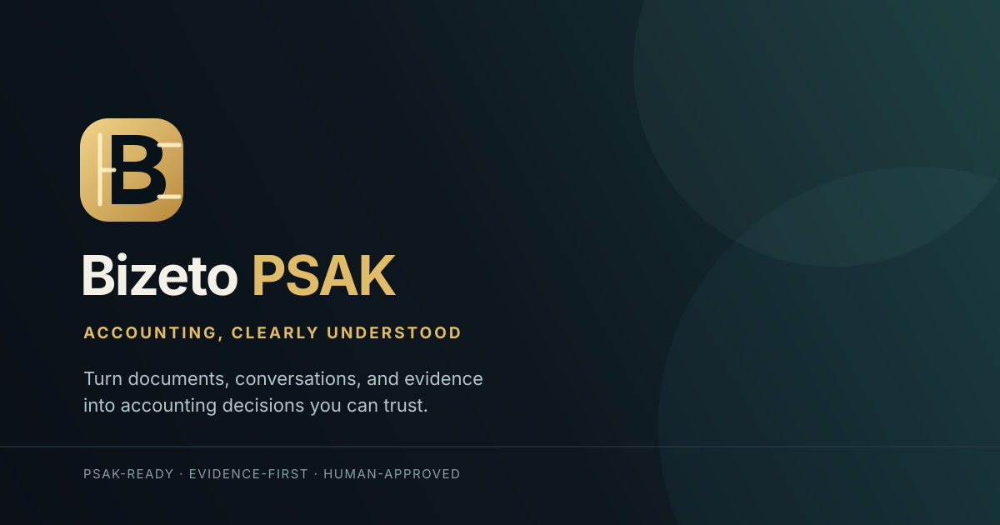

# Bizeto PSAK Brand Assets

Identitas visual Bizeto PSAK memakai mark berbentuk **B + balanced ledger + evidence mark**:

- Huruf B abstrak: identitas Bizeto dan business intelligence.
- Dua sisi ledger: keseimbangan debit dan kredit.
- Garis evidence: sumber data, audit trail, dan bukti yang dapat ditelusuri.
- Champagne gold: otoritas, trust, kualitas, dan standar profesional PSAK.
- Teal/cyan: intelligence dan validasi; digunakan sebagai aksen sekunder.
- Slate: stabilitas, profesionalitas, dan ruang kerja.

## Brand color hierarchy

```text
Graphite / Slate  → foundation
Champagne Gold    → Bizeto PSAK identity, trust, authority
Teal / Cyan       → AI activity, live state, validation
Red / Amber       → exception and review state
```

## Asset

| Asset | File | Penggunaan |
|---|---|---|
| Favicon | `assets/brand/favicon.svg` | Browser tab, bookmark, PWA icon source |
| Navbrand light | `assets/brand/navbrand.svg` | Logo + wordmark pada light theme |
| Navbrand dark | `assets/brand/navbrand-dark.svg` | Logo + wordmark pada dark theme |
| Splash | `assets/brand/splash.svg` | Loading screen, onboarding, app launch |
| OG image | `assets/brand/og-image.svg` | Open Graph/social preview |

## Visual preview

### Favicon / App mark


### Navigation brand — light theme


### Navigation brand — dark theme

<div style="display:inline-block;background:#0E171F;padding:16px 20px;border-radius:10px">
  
</div>

### Splash image



### Open Graph image



## Rekomendasi penggunaan

```tsx
// Next.js metadata
export const metadata = {
  title: 'Bizeto PSAK',
  icons: { icon: '/brand/favicon.svg' },
  openGraph: {
    title: 'Bizeto PSAK',
    description: 'Accounting, clearly understood.',
    images: ['/brand/og-image.svg'],
  },
};
```

Navbrand memakai SVG horizontal pada desktop. Gunakan `navbrand.svg` untuk light theme dan `navbrand-dark.svg` untuk dark theme. Pada sidebar collapsed dan mobile, gunakan `favicon.svg` atau mark saja.

Splash tidak boleh muncul pada setiap perpindahan halaman. Gunakan hanya saat initial app boot, onboarding, atau pemulihan session.

Semua asset menggunakan SVG vector agar tetap tajam pada retina display dan dapat dipakai sebagai sumber konversi PNG jika platform eksternal membutuhkannya.
