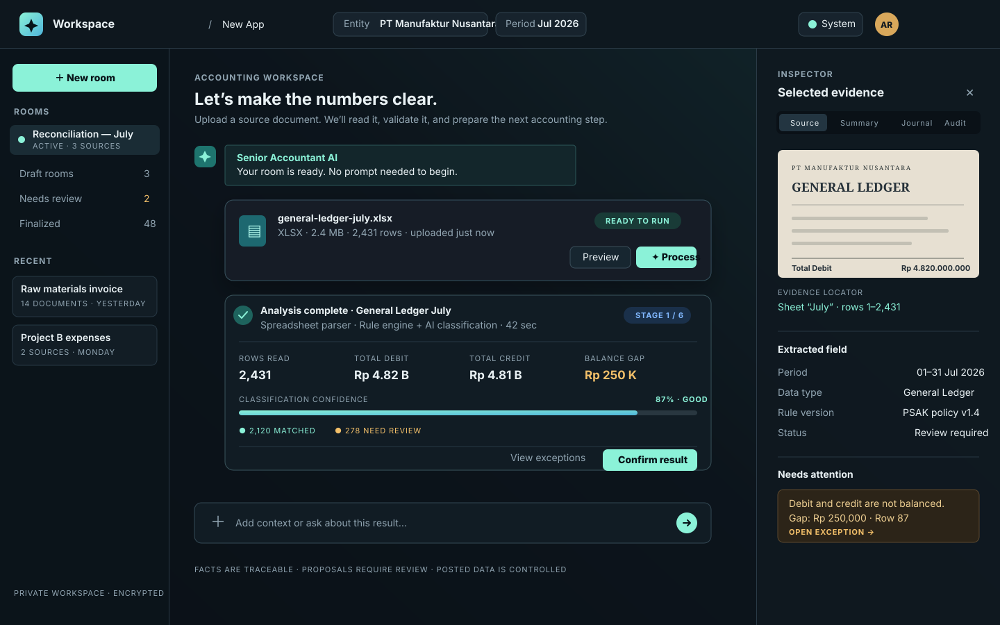

# Design System Workspace

## 1. Arah produk

Workspace harus terasa seperti produk accounting modern kelas dunia: tenang, tajam, mudah dipahami, dan dapat dipercaya. Visualnya tidak boleh terasa seperti dashboard ERP lama yang penuh tabel, juga tidak boleh seperti chatbot eksperimental yang terlalu playful.

Prinsip utama:

```text
Clear by default
Dense but breathable
Elegant, not decorative
Professional, not rigid
Human-friendly, audit-ready
```

Halaman ini adalah pusat interaksi user dengan data, AI, bukti transaksi, review, dan keputusan akuntansi.

## 2. Keputusan stack

### Rekomendasi utama

```text
Next.js App Router
React + TypeScript
Tailwind CSS
shadcn/ui
Radix UI primitives
next-themes
Lucide React
Zod
next-intl atau i18next
```

### Catatan tentang Next.js dan Vite

Next.js dan Vite sebaiknya tidak digunakan sebagai bundler utama secara bersamaan. Pilih salah satu:

| Pilihan | Kapan digunakan |
|---|---|
| Next.js + App Router | Rekomendasi untuk app shell, route kompleks, server boundary, dan deployment production |
| React + Vite | Pilihan jika aplikasi sengaja dibuat sebagai SPA tanpa kebutuhan Next.js |

Dokumen ini menggunakan asumsi **Next.js App Router**. Jika implementasi final memakai Vite, token desain, komponen shadcn, Tailwind, i18n, dan state model tetap sama.

## 3. Bahasa dan i18n

Bahasa default aplikasi adalah **English** untuk nuansa produk global. Bahasa Indonesia tersedia sebagai pilihan utama kedua.

User dapat mengganti bahasa melalui profile/preferences menu. Pilihan bahasa disimpan per user, bukan hanya di browser.

### Tone of voice

- Singkat.
- Tegas.
- Tidak birokratis.
- Tidak menggunakan jargon AI berlebihan.
- Menjelaskan risiko dengan jelas.
- Selalu membedakan fakta, usulan, dan tindakan user.

### Diksi yang disarankan

| English | Indonesia | Hindari |
|---|---|---|
| Workspace | Ruang Kerja | Ruang AI |
| New Room | Sesi Baru | Buat Chat |
| Process data | Proses data | Run AI |
| Review required | Perlu ditinjau | Error AI |
| Evidence | Bukti | Source blob |
| Proposed journal | Usulan jurnal | AI journal |
| Confirm extraction | Konfirmasi pembacaan | Approve AI |
| Ready for approval | Siap disetujui | Almost done |
| Save as draft | Simpan sebagai draf | Save temporary |
| Post to ledger | Posting ke buku besar | Submit |
| Finalized | Difinalkan | Locked forever |
| Needs attention | Perlu perhatian | Warning only |

### Contoh copy modern

```text
EN: Your room is ready. Upload a source document to begin.
ID: Ruang Anda siap. Unggah dokumen sumber untuk memulai.
```

```text
EN: We found 3 items that need your review.
ID: Kami menemukan 3 item yang perlu Anda tinjau.
```

```text
EN: This result is a proposal, not a posted journal.
ID: Hasil ini adalah usulan, bukan jurnal yang sudah diposting.
```

### Struktur i18n

```text
messages/
  en.json
  id.json

messages/en.json
  common.*
  navigation.*
  workspace.*
  source.*
  review.*
  journal.*
  errors.*
  accessibility.*
```

Jangan menaruh teks UI langsung di JSX. Semua label, tooltip, empty state, error, toast, dialog, dan status wajib memiliki translation key.

## 4. Theme system

### Default theme

Default adalah **System**.

Urutan keputusan theme:

```text
User preference
    ↓ jika belum ada
Operating system preference
    ↓ jika tidak tersedia
Light
```

Pilihan yang tersedia:

```text
System · Light · Dark
```

Implementasi Next.js menggunakan `next-themes` dengan `attribute="class"`, `enableSystem`, dan pencegahan flash saat hydration.

### Theme switcher

Switcher berada di user menu/topbar dan menyediakan:

- System — mengikuti perangkat.
- Light — tampilan terang.
- Dark — tampilan gelap.

Ikon harus menunjukkan kondisi aktif, tetapi jangan mengandalkan ikon saja. Gunakan label dan `aria-label` yang jelas.

## 5. Warna visual

Warna utama tidak boleh terlalu kaku seperti biru korporat generik. Gunakan slate gelap sebagai fondasi, teal sebagai intelligent accent, dan amber sebagai review accent.

### Light theme

```css
--background: 220 25% 97%;
--foreground: 222 32% 12%;
--card: 0 0% 100%;
--muted: 215 20% 94%;
--muted-foreground: 215 14% 42%;
--border: 215 18% 87%;
--primary: 170 65% 31%;
--primary-foreground: 0 0% 100%;
--accent: 211 80% 47%;
--warning: 37 78% 42%;
--destructive: 0 67% 47%;
--success: 160 63% 31%;
```

### Dark theme

```css
--background: 222 30% 8%;
--foreground: 210 28% 94%;
--card: 221 25% 12%;
--muted: 218 22% 17%;
--muted-foreground: 214 16% 63%;
--border: 216 20% 23%;
--primary: 169 68% 64%;
--primary-foreground: 218 35% 10%;
--accent: 211 90% 72%;
--warning: 39 83% 66%;
--destructive: 0 77% 72%;
--success: 160 67% 65%;
```

### Makna warna

| Warna | Makna |
|---|---|
| Teal | AI aktif, data valid, proses berhasil |
| Blue | Informasi, evidence, link, detail |
| Amber | Perlu review, asumsi, confidence rendah |
| Red | Gagal, tidak seimbang, tindakan berbahaya |
| Slate | Struktur, navigasi, background |

Jangan menggunakan warna hanya untuk dekorasi. Setiap warna harus memiliki arti operasional.

## 6. Tipografi

Tipografi harus tegas, jelas, dan mudah dibaca dalam tabel maupun percakapan.

### Rekomendasi font

```text
UI / body: Geist Sans atau Inter
Data / angka / kode: Geist Mono atau JetBrains Mono
```

Jika memakai Next.js, gunakan `next/font` agar font dioptimalkan dan tidak bergantung pada external stylesheet saat runtime.

### Type scale

| Token | Size | Weight | Penggunaan |
|---|---:|---:|---|
| display | 30px | 700 | Judul New App |
| heading-lg | 22px | 700 | Judul room |
| heading-md | 16px | 650 | Card section |
| body | 14px | 450 | Isi utama |
| body-sm | 13px | 450 | Metadata dan helper |
| label | 12px | 600 | Label field dan status |
| caption | 11px | 500 | Timestamp, evidence locator |
| numeric-xl | 24px | 700 | Total debit/kredit |
| numeric | 13px | 600 | Angka tabel |

Gunakan `tabular-nums` untuk angka accounting dan `font-mono` hanya untuk kode, hash, ID, dan data teknis.

## 7. Spacing dan density

Karena Workspace adalah pusat kerja user, layar tidak boleh membuang banyak ruang. Namun kepadatan harus tetap nyaman dibaca.

```text
Base spacing: 4px
Page padding desktop: 24px
Panel gap: 16px
Card padding: 16px
Table cell padding: 10px 12px
Toolbar gap: 8px
```

Jangan membuat seluruh layar berupa card besar dengan padding berlebihan. Gunakan grouping, divider tipis, dan section header untuk mengatur informasi.

## 8. Rounding dan elevation

Rounding standar harus konsisten dan tidak terlalu membulat.

```text
radius-sm: 6px   → input, badge, small control
radius-md: 8px   → button, table, menu
radius-lg: 12px  → card, panel, dialog
radius-xl: 16px  → hero/empty state utama saja
radius-full     → avatar, status dot, pill
```

Hindari semua elemen menggunakan `rounded-3xl`. Produk accounting profesional membutuhkan struktur visual yang lebih presisi.

Elevation:

- Light: border + shadow sangat tipis.
- Dark: border lebih penting daripada shadow.
- Dialog dan floating inspector boleh memakai shadow kuat.
- Jangan memakai gradient besar sebagai background utama.

## 9. Layout Workspace final

### Preview UI/UX

Preview visual pertama untuk design system ini:



Preview ini menunjukkan arah visual yang dikunci:

- Topbar ringkas dengan entity, periode, theme switcher, dan profile.
- Room history di kiri sebagai daftar workspace, bukan sidebar modul ERP yang panjang.
- Discussion canvas di tengah sebagai area interaksi utama.
- Processing card untuk sumber data dan tombol **Preview / Process**.
- AI Result Card dengan metrik, confidence, exception, dan tombol konfirmasi.
- Composer yang tetap tersedia untuk konteks tambahan tanpa menjadikan prompt sebagai syarat.
- Inspector di kanan yang menampilkan dokumen, evidence locator, hasil ekstraksi, dan exception.

Prototype HTML interaktif tersedia di [Workspace UI preview](processing-room-ui.html).

### Desktop

```text
┌──────────────────────────────────────────────────────────────┐
│ Topbar: Logo · Room title · Entity · Period · Theme · Profile │
├────────────┬───────────────────────────────────┬─────────────┤
│ 240px      │ minmax(520px, 1fr)                │ 320px       │
│ Room list  │ Discussion canvas                 │ Inspector   │
│            │                                   │             │
│            │ Upload / process cards           │             │
│            │ AI analysis                      │             │
│            │ User review                      │             │
│            │ Composer                         │             │
└────────────┴───────────────────────────────────┴─────────────┘
```

### Mobile/tablet

- Room list menjadi drawer.
- Inspector menjadi bottom sheet atau side sheet.
- Discussion canvas tetap menjadi prioritas utama.
- Composer selalu dapat dijangkau.
- Tabel hasil menggunakan horizontal scroll yang terkontrol.
- Tombol aksi utama tetap visible tanpa menutupi konten.

## 10. Komponen visual utama

### New App Card

Satu card utama dengan pilihan jenis pekerjaan. Jangan menampilkan terlalu banyak template.

### Processing Card

Menampilkan:

- File name.
- File type.
- File size.
- Processing stage.
- Tool selected.
- Progress.
- Warnings.
- Primary action.

### AI Result Card

Menampilkan:

- Summary.
- Facts detected.
- Confidence.
- Exceptions.
- Source references.
- Preview.
- Confirm action.

### Evidence Inspector

Menampilkan:

- Source preview.
- Extracted value.
- Normalized value.
- Evidence locator.
- Confidence.
- Rule/model metadata.
- Correction history.

### Journal Proposal Card

Menampilkan:

- Debit lines.
- Credit lines.
- Total balance.
- Account mapping reason.
- Tax treatment.
- Approval status.
- Draft/approve/post actions.

## 11. Accessibility dan kualitas interaksi

- Kontras teks minimal WCAG AA.
- Semua icon button memiliki tooltip dan `aria-label`.
- Keyboard navigation wajib bekerja untuk upload, preview, inspector, dan approval.
- Focus state tidak boleh dihilangkan.
- Status processing tidak hanya dibedakan melalui warna; gunakan icon dan teks.
- Error harus menjelaskan penyebab dan tindakan berikutnya.
- Loading state memakai skeleton/progress, bukan hanya spinner.
- Toast tidak boleh menjadi satu-satunya tempat informasi penting.
- Angka debit/kredit harus dapat dibaca screen reader dengan label lengkap.

## 12. Guardrail copy dan visual akuntansi

UI harus selalu membedakan:

```text
Detected fact     → fakta yang dibaca dari sumber
AI suggestion     → usulan AI
User correction   → koreksi manusia
Approved journal  → jurnal yang disetujui
Posted ledger     → jurnal resmi di buku besar
Finalized record  → data yang dikunci
```

Jangan menggunakan copy seperti:

```text
AI telah membukukan transaksi Anda
```

Gunakan:

```text
Journal proposal ready for review
Usulan jurnal siap ditinjau
```

## 13. Definition of done untuk Workspace UI

- [ ] New App screen tersedia dan terasa seperti entry point produk modern.
- [ ] Workspace dapat dibuka tanpa bergantung pada dashboard utama.
- [ ] Default theme mengikuti system.
- [ ] Light, dark, dan system theme berjalan tanpa flash.
- [ ] Bahasa English dan Indonesia tersedia pada seluruh UI.
- [ ] Tidak ada hardcoded user-facing copy di komponen.
- [ ] Empty, ready, processing, result, review, error, confirmed, posted, dan final state tersedia.
- [ ] Layout tidak menyisakan ruang kosong yang tidak berguna.
- [ ] Inspector bersifat kontekstual dan evidence-first.
- [ ] Typography konsisten untuk copy, metadata, angka, dan hash.
- [ ] Button, input, card, dialog, table, badge, tooltip, tabs, drawer, dan sheet memakai shadcn/Radix yang konsisten.
- [ ] Responsive behavior tervalidasi untuk desktop, tablet, dan mobile.
- [ ] Keyboard navigation dan contrast check selesai.
