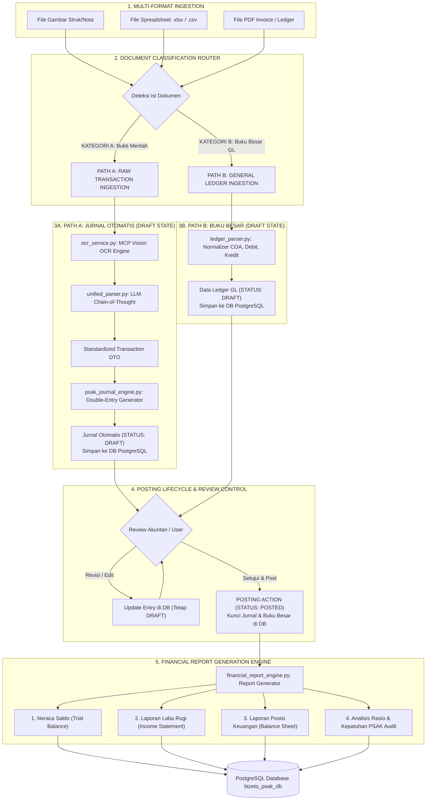
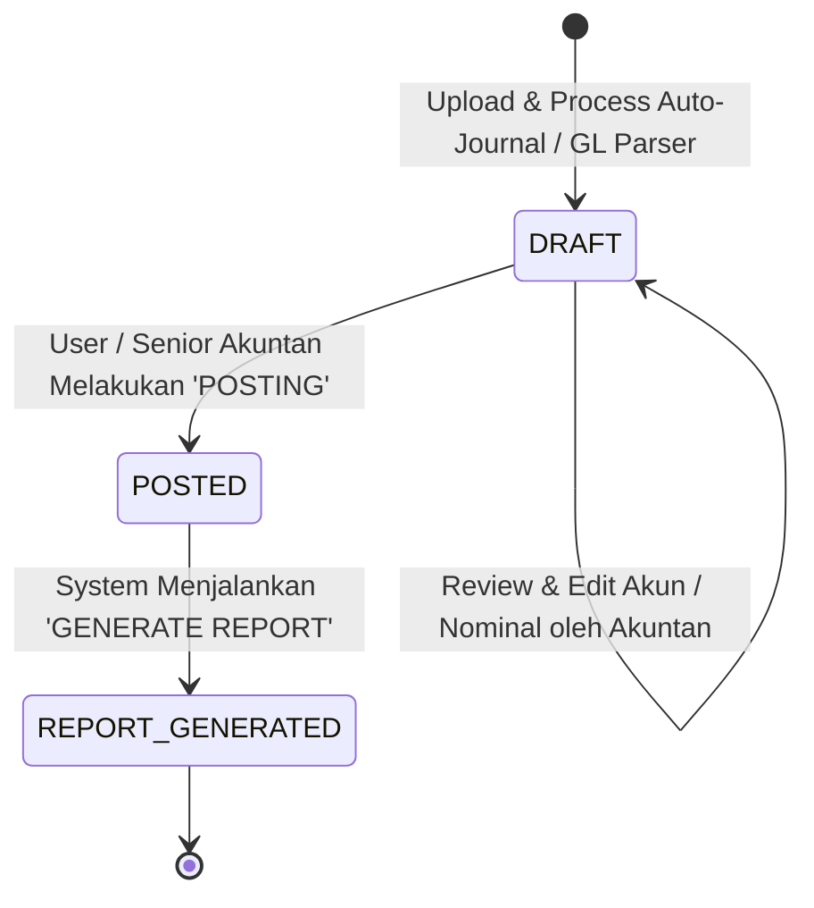

# Arsitektur Unified OCR & Multi-Format Document Ingestion Engine

**Bizeto PSAK Enterprise** — Arsitektur pemrosesan dokumen akuntansi multi-format berstandar PSAK berbasis 3 jalur ingestion (OCR Gambar, Spreadsheet, & PDF/Teks) dengan **Document Classification Router** dan **Posting Lifecycle Control** (`Draft` ➔ `Posted` ➔ `Generate Report`).

---

## 🏛️ 1. Diagram Arsitektur & Alur Data (Mermaid)



---

## 🔄 2. Lifecycle Status Dokumen & Jurnal (`Draft` ➔ `Posted` ➔ `Generate Report`)

Seluruh hasil analisis dari **Path A (Jurnal Otomatis)** maupun **Path B (Buku Besar)** wajib mengikuti alur status siklus akuntansi formal:



### **Penjelasan Tahapan Status Lifecycle:**

1. **Status `DRAFT` (Tahap Awal Ingestion)**:
   - Hasil ekstraksi OCR, parsing Excel, dan pembuatan Jurnal Otomatis **langsung disimpan ke PostgreSQL Database** dengan status `DRAFT`.
   - Pada status ini, data **BELUM mempengaruhi** Laporan Keuangan resmi entitas.
   - User / Akuntan dapat meninjau, mengedit nama akun, menyesuaikan nominal, atau memperbaiki klasifikasi transaksi di workspace UI.

2. **Status `POSTED` (Tahap Pembekuan & Posting Jurnal)**:
   - Setelah user/akuntan menyetujui draf jurnal atau data ledger, user mengklik tombol **"POSTING"** (atau via perintah chat *"Post jurnal ini"*).
   - Backend mengubah status di PostgreSQL dari `DRAFT` ➔ `POSTED`.
   - Data jurnal yang berstatus `POSTED` dikunci (locked) untuk mencegah perubahan tidak disengaja dan siap dihitung dalam pembukuan resmi.

3. **Tahap `GENERATE REPORT` (Tahap Pembuatan Laporan Keuangan)**:
   - `financial_report_engine.py` HANYA menarik data transaksi dan jurnal yang memiliki status **`POSTED`**.
   - Menghasilkan set Laporan Akuntansi resmi:
     - **Neraca Saldo (Trial Balance)**
     - **Laporan Laba Rugi (Income Statement / PnL)**
     - **Laporan Posisi Keuangan (Balance Sheet)**
     - **Catatan & Kepatuhan PSAK Audit**

---

## ⚙️ 3. Rincian Komponen Arsitektur & Jalur Ekstraksi

### **A. Jalur 1: OCR Gambar (Struk / Nota / Faktur Supplier)**
- Mengadopsi 100% alur OCR `ocrTool.ts` dari Jualan/MCP Server (`mcp.samkarsa.com`).
- **Pass 1 (Quick Scan)**: Deteksi profil merchant dan kolom tabel nota secara instan.
- **Pass 1.5 (Dynamic RAG Injection)**: Query pencarian vektor ke PostgreSQL `knowledge_vectors` (`similarity >= 0.60`) untuk menyuntikkan aturan penafsiran khusus nota.
- **Pass 2 (Deep Vision Extraction)**: Gemini Vision API mengekstraksi data dengan aturan pembersihan SKU/Prefix, kapitalisasi nama barang, dan penyesuaian UOM.

---

### **B. Jalur 2: Excel & CSV Engine (`excel_parser.py`)**
Banyak laporan transaksi dari supplier/minimarket dikirim dalam format `.xlsx`, `.xls`, atau `.csv` dengan berbagai struktur sheet.

- **Sheet Inspector**: Membaca semua tab/sheet di workbook (misal: *Sheet1*, *Laporan Pembelian*, *Daftar Barang*).
- **Header Normalizer**: Mengidentifikasi baris tabel transaksi secara fleksibel dengan mencocokkan kata kunci header:
  - *Nama Barang*: `Item`, `Product`, `Nama Barang`, `Deskripsi`
  - *Kuantitas*: `Qty`, `Jumlah`, `Kuantitas`
  - *Harga Satuan*: `Harga`, `Price`, `Satuan`, `@`
  - *Total*: `Subtotal`, `Total`, `Jumlah Rp`
- **Row Stream Formatter**: Mengubah setiap baris tabel Excel menjadi narasi teks terstruktur yang bersih agar siap dipahami oleh *Unified Parser Engine*.

---

### **C. Jalur 3: Smart Hybrid PDF Engine (`pdf_parser.py`)**
PDF memiliki 2 kemungkinan tipe: **PDF Berbasis Teks (Digital)** atau **PDF Hasil Scan/Foto (Raster Image)**.

- **PDF Text Stream (Digital PDF)**:
  - Menggunakan `pdfplumber` / `pypdf` untuk membaca teks mentah secara cepat dalam waktu milidetik.
  - Jika teks yang terambil > 50 karakter, teks langsung diteruskan ke *Unified Parser Engine*.
- **PDF Scan Fallback (Scanned Document)**:
  - Jika teks dalam PDF < 50 karakter (PDF hasil foto/scan scanner), sistem menggunakan `PyMuPDF (fitz)` untuk **merender halaman PDF menjadi gambar WebP**.
  - Gambar halaman tersebut secara otomatis **dialihkan ke Jalur 1 (MCP Vision OCR)** untuk dibaca tulisan tangannya/struknya.

---

## 🔀 4. Document Classification Router (`classification_router.py`)

Dokumen dipilah secara otomatis menggunakan **Header & Keyword Matching**:

| Kriteria Deteksi | Kategori A: Bukti Transaksi Mentah | Kategori B: Buku Besar / General Ledger |
| :--- | :--- | :--- |
| **Kata Kunci Kolom/Header** | `Nama Barang`, `Qty`, `Harga Satuan`, `Kasir`, `Diskon` | `Kode Akun`, `COA`, `Debit`, `Kredit`, `Saldo`, `Account Name` |
| **Pola Dokumen** | Struk minimarket, invoice supplier 1 halaman | Tabel multi-baris berisi daftar transaksi ber-Jurnal |
| **Tujuan Pemrosesan** | **Path A: Diminta Membuat Jurnal Baru** | **Path B: Langsung Diproses ke Ledger DRAFT** |

---

## 📊 5. Alur Pemrosesan Buku Besar (Path B ➔ Financial Report Engine)

Ketika PDF atau Excel terdeteksi sebagai **Buku Besar (Kategori B)**:

### **Langkah 1: Ekstraksi & Normalisasi Buku Besar (`ledger_parser.py`)**
- Membaca baris-baris Buku Besar tanpa memecah nama barang ritel satu-satu.
- Mengstrak field utama: `Tanggal`, `Kode Akun (COA)`, `Nama Akun`, `Deskripsi/Uraian`, Nominal `Debit`, Nominal `Kredit`.
- Simpan ke PostgreSQL Database dengan status `DRAFT`.

### **Langkah 2: Posting & Transformasi ke Laporan Akuntansi (`financial_report_engine.py`)**
Setelah status di-posting menjadi `POSTED`, data Buku Besar diproses menjadi **Set Laporan Keuangan PSAK**:

1. **Neraca Saldo (Trial Balance)**: Rekapitulasi akumulasi Debit & Kredit setiap akun COA.
2. **Laporan Laba Rugi (Income Statement)**:
   $$\text{Laba Bersih} = \text{Total Pendapatan} - (\text{HPP} + \text{Total Beban Operasional})$$
3. **Laporan Posisi Keuangan (Balance Sheet)**:
   $$\text{Total Aset} = \text{Total Liabilitas} + \text{Total Ekuitas}$$
4. **Analisis Rasio & Health Check PSAK**: Rasio Likuiditas (Current Ratio), Net Profit Margin (NPM), dan Peringatan Kepatuhan Akuntansi.

---

## 🎯 6. Titik Temu Path A: Unified Parser Engine (`unified_parser.py`)

Seluruh hasil ekstraksi dari Bukti Mentah (Path A) dikonvergensikan ke satu titik **Unified Parser Engine** (diadopsi dari `transactionParser.ts` Jualan):

- **Chain-of-Thought (`_reasoning`)**: Mengevaluasi matematika harga, diskon, metode pembayaran, dan due date sebelum menghasilkan JSON final.
- **Klasifikasi Tipe Transaksi**:
  - `purchase` (Pembelian/Restock Supplier)
  - `sales` (Penjualan Pelanggan)
  - `operational` (Beban/Pengeluaran Operasional)
  - `purchase_return` (Retur Pembelian ke Supplier)
  - `sales_return` (Retur Penjualan dari Pelanggan)
- **Validasi Jatuh Tempo & Pembayaran**:
  - Jika metode pembayaran adalah `tempo` atau `kredit` dan `due_date` sudah lewat dari hari ini, sistem otomatis memaksa `payment_method = cash` agar pencatatan kas masuk/keluar tepat waktu.

---

## 📑 7. Automatic PSAK Journal Engine (`psak_journal_engine.py`)

Dari DTO transaksi terstandar (Path A), engine jurnal otomatis membuat pasangan ayat jurnal **Double-Entry (Debit/Kredit)** berstandar PSAK dengan status awal `DRAFT`:

| Jenis Transaksi | Akun Debit (Dr) | Akun Kredit (Cr) |
| :--- | :--- | :--- |
| **Pembelian Tunai** | Persediaan / Perlengkapan (Dr)<br/>PPN Masukan (Dr - Jika Ada) | Kas / Bank (Cr) |
| **Pembelian Kredit (Tempo)** | Persediaan / Perlengkapan (Dr) | Utang Usaha (Cr) |
| **Beban Operasional** | Beban Operasional (Dr) | Kas / Bank (Cr) |
| **Penjualan Tunai** | Kas / Bank (Dr)<br/>HPP (Dr) | Pendapatan Penjualan (Cr)<br/>Persediaan (Cr) |
| **Retur Pembelian** | Utang Usaha / Kas (Dr) | Retur Pembelian / Persediaan (Cr) |

---

## 🧱 8. Struktur File Backend (`backend/app/services/`)

Modul backend disusun secara lengkap dan modular:

```text
backend/app/services/
├── ocr_service.py              # [Path A] Panggilan ke MCP Vision OCR (Alur Jualan)
├── excel_parser.py             # [Path A/B] Engine pembaca & normalisasi Excel/CSV
├── pdf_parser.py               # [Path A/B] Smart Hybrid Engine PDF (Text Stream vs Render Image)
├── classification_router.py    # [Router] Pemilah Bukti Mentah vs Buku Besar (GL)
├── unified_parser.py           # [Path A] Unified Parser Engine dari prompt Jualan -> Journal DTO
├── psak_journal_engine.py      # [Path A] Generator Jurnal Double-Entry PSAK (Status: DRAFT)
├── ledger_parser.py            # [Path B] Parser Struktur Buku Besar (Status: DRAFT)
├── posting_service.py          # [Lifecycle] Service Pengubah Status DRAFT -> POSTED
└── financial_report_engine.py  # [Report] Generator Laporan Keuangan dari Data POSTED
```

---

## 🛡️ 9. Jalur Penyimpanan & Keamanan Data (PostgreSQL Server-Side)

Seluruh data jurnal (`DRAFT` & `POSTED`), laporan keuangan (`REPORT_GENERATED`), berkas dokumen, status audit trail, dan sesi pengguna tersimpan murni di **PostgreSQL 16 (`bizeto_psak_db`)** di VPS (`jkk-db` network) tanpa menyimpan data transaksi sensitif di LocalStorage client.
